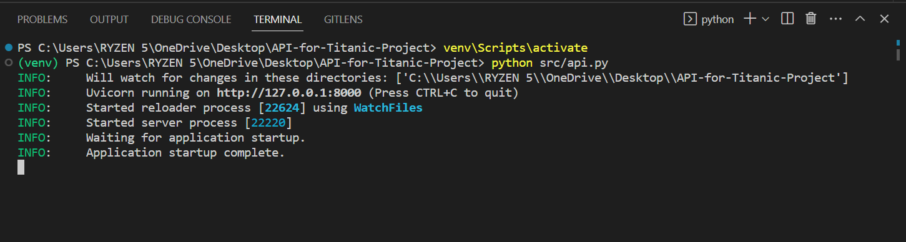
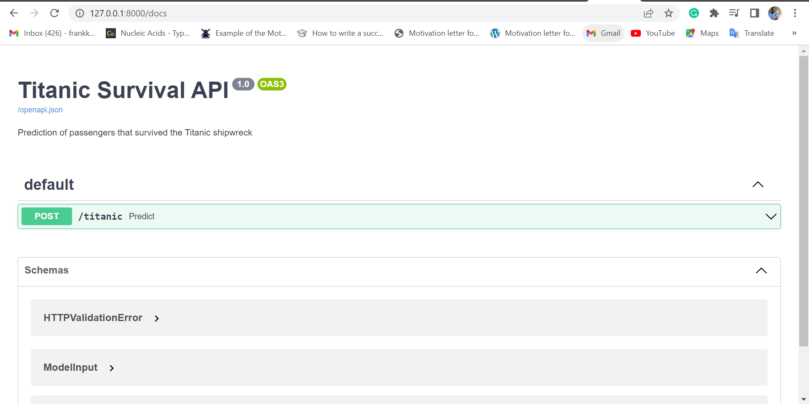

# ML API using Titanic Dataset
The purpose of this project is to create an ML API endpoint to predict against the request received from clients

# Setup
Find the commands below to setup this project and execute it. You must install Python3 (<3.10)

Windows:

  python -m venv venv; venv\Scripts\activate; python -m pip install -q --upgrade pip; python -m pip install -qr requirements.txt  
Linux & MacOs:

  python3 -m venv venv; source venv/bin/activate; python -m pip install -q --upgrade pip; python -m pip install -qr requirements.txt  

Execution
To run this project, please type the command below being at the repo's root:

    python src/api.py

  Below is the executed Output
    

Additional Info:
  View of the API documentations in your browser
  

  To open documentation in your browser, add "/docs" to your URL or
    

# Author:
- [FK Baffour](https://www.linkedin.com/in/frank-kyei-baffour-403b60100/)